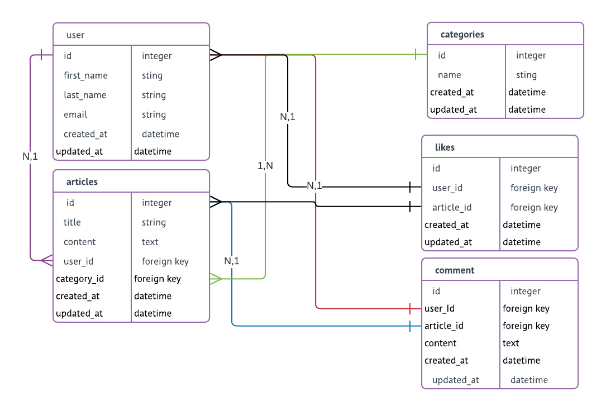

<!DOCTYPE html>
<html>
<body>
  <h1>App ruby blog de famille - THP</h1>
    <h2>Groupe de Rennes Leona Chevrel et Christophe Leray </h2>
      <h3>Ruby version: 2.5.1</h3>
      <h3>Ruby app creation</h3>
      
Create a new app in your favorite folder, the app will be called blog_famille here

        <code>$ rails new blog_famille</code>
        
Add gem faker in the gemfile: require 'faker'

        
Then run the commande bunde install to install all the gem:
 
        <code>$ bundle install</code>
        
      

        <h3>Database structure: </h3>
        
5 tables:

        <ul> 
          <il>user</il>
          <il>articles</il>
          <il>categories</il>
          <il>likes</il>
          <il>comment</il>
        </ul>
     

      

        
      

      

        <h3>Create a new model for the different tables:</h3>
        <code>$ rails generate model User</code>
        <code>$ rails generate model Article</code>
        <code>$ rails generate model Category</code>
        <code>$ rails generate model Like</code>
        <code>$ rails generate model Comment</code>
    

</body>
</html>

This README would normally document whatever steps are necessary to get the
application up and running.

Things you may want to cover:

* Ruby version

* System dependencies

* Configuration

* Database creation

* Database initialization

* How to run the test suite

* Services (job queues, cache servers, search engines, etc.)

* Deployment instructions

* ...
